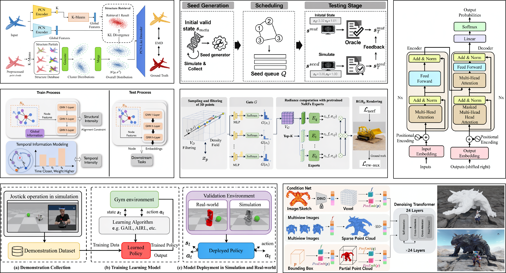

<div align="center">

# SciForma: Structure-Faithful Generation of Scientific Diagrams

<p>
  <a href="https://arxiv.org/"></a>
  &nbsp;
  <a href="https://huggingface.co/microsoft/SciForma-9B"></a>
  &nbsp;
  <a href="https://huggingface.co/datasets/microsoft/SciFormaData-700K"></a>
  &nbsp;
  <a href="https://huggingface.co/datasets/microsoft/SciFormaBench"></a>
  &nbsp;
  <a href="LICENSE"></a>
</p>

**Yuxuan Luo<sup>1</sup> · Peng Zhang<sup>2</sup> · Xinjie Zhang<sup>3</sup> · Xun Guo<sup>3</sup> · Zhouhui Lian<sup>1✉</sup> · Yan Lu<sup>3</sup>**

<sup>1</sup>Peking University &nbsp;&nbsp; <sup>2</sup>Zhejiang University &nbsp;&nbsp; <sup>3</sup>Microsoft Research Asia

<a href="assets/teaser.pdf"></a>

</div>

---

**SciForma** is a 9B-parameter framework for the *structure-faithful* generation of scientific methodology diagrams. SciForma decomposes diagram quality into three independently verifiable axes — **Component**, **Arrow**, and **Text** — guided by a *structural inventory*. Built on FLUX.2-klein-base-9B, it is fine-tuned in two SFT stages then post-trained with **Multi-Dimensional Conjunctive Preference Optimization (M-DPO)**, which enforces simultaneous correctness across all axes and adaptively routes gradients toward the most deficient axis.

## Highlights

- **Structural inventory.** Per-axis (Component / Arrow / Text) verification with critical/moderate error severity instead of a single holistic score.
- **M-DPO.** Multi-way Bradley–Terry objective with dimension-anchored preference construction and adaptive gradient reweighting — breaks the SFT plateau where scalar DPO / GDRO / GRPO stagnate.
- **LaTeX-to-Diagram Agent.** Generate figures directly from your paper's LaTeX source via a GPT planner + SciForma-9B renderer.
- **Data & benchmark.** `SciFormaData-700K` (661K generation pairs + 70K editing triplets) and `SciFormaBench-2K` (Simple 500 / Medium 900 / Hard 600) with human-verified inventories.

---

## Results

On **SciFormaBench-2K** (GPT-5.4 judge):

| Method | Average | Component | Arrow | Text |
| :--- | :---: | :---: | :---: | :---: |
| GPT-Image-2 | 85.62 | 83.34 | 89.61 | 83.53 |
| Nano Banana Pro | 81.34 | 81.10 | 83.60 | 78.70 |
| GPT-Image-1.5 | 68.96 | 75.70 | 62.50 | 68.20 |
| **SciForma-9B (+ M-DPO)** | 69.51 | 74.49 | 66.46 | 67.00 |
| **SciForma-Base (SFT)** | 67.59 | 73.52 | 64.64 | 63.84 |
| Wan2.7-Image | 64.71 | 73.90 | 60.30 | 61.10 |
| FLUX.2-klein-base-9B | 33.87 | 51.50 | 25.20 | 23.60 |

On **AIBench**, SciForma-9B reaches **70.29**, edging human-drawn originals (70.09) with the largest margin on Topology (+6.19). As a drop-in Visualizer inside PaperBanana, SciForma achieves a **30.7%** pairwise win rate against human-drawn originals.

## 🤖 Pretrained Models

| Model | Overall ↑ | Comp. ↑ | Arrow ↑ | Text ↑ | Download |
|-------|-----------|---------|---------|--------|----------|
| **SciForma-9B** | **69.51** | 74.49 | 66.46 | 67.00 | [🤗 HuggingFace](https://huggingface.co/microsoft/SciForma-9B) |
| **SciForma-Base** | 67.59 | 73.52 | 64.64 | 63.84 | [🤗 HuggingFace](https://huggingface.co/microsoft/SciForma-Base) |

Both models are fine-tuned from [FLUX.2-klein-base-9B](https://huggingface.co/black-forest-labs/FLUX.2-klein-base-9B).

---

## 📦 Installation

### Requirements

- **Python 3.10** (mmengine 0.10.7 requires 3.10; Python 3.11+ not tested), CUDA 12.1
- GPU: ≥ 24 GB VRAM for inference (one A100/H100/B200); 8× B200 for training

### Setup

```bash
# Clone
git clone https://github.com/microsoft/SciForma.git
cd SciForma

# Create conda environment
conda create -n sciforma python=3.10 -y
conda activate sciforma

# Install PyTorch (CUDA 12.1)
pip install torch==2.5.1 torchvision torchaudio \
    --index-url https://download.pytorch.org/whl/cu121

# Install diffusers from git (required for Flux2Klein / Flux2Transformer2DModel support)
pip install git+https://github.com/huggingface/diffusers.git

# Install all other dependencies
pip install -r requirements.txt

# (Optional, recommended for training) Flash Attention 2 — requires nvcc
# pip install flash-attn --no-build-isolation
```

Or use the provided setup script:

```bash
bash env_setup/init_flux2_env.sh
```

### Set credentials

```bash
export HF_TOKEN="hf_..."          # HuggingFace token (required to download FLUX.2-klein)
export SCIFORMA_DATA_ROOT="/path/to/data"   # root for training data & checkpoints
export WANDB_API_KEY="..."         # optional, for training monitoring
```

### Verify Installation

After setup, run the verification script to confirm everything is working:

```bash
# Basic check (imports + configs, ~10 seconds): 10 passed expected
python training/scripts/verify_setup.py

# Full check including dataset + benchmark GT + scripts: 26 passed expected
export SCIFORMA_DATA_ROOT=/your/data/path
export SCIFORMA_GT_BASE=$SCIFORMA_DATA_ROOT/SciFormaData-700K/generation/images_1024/1024_pretrain
python training/scripts/verify_setup.py --check-data --check-scripts
```

Expected output: `✅ All critical checks passed — ready to train!`

---

## 💡 Usage

### Generation

Generate a scientific methodology diagram from a structured text description:

```python
import torch
from diffusers import Flux2KleinPipeline, Flux2Transformer2DModel

# Load fine-tuned transformer from HuggingFace
transformer = Flux2Transformer2DModel.from_pretrained(
    "microsoft/SciForma-9B",
    subfolder="transformer",
    torch_dtype=torch.bfloat16,
    token="hf_...",
)

# Load full pipeline with base model components
pipe = Flux2KleinPipeline.from_pretrained(
    "black-forest-labs/FLUX.2-klein-base-9B",
    transformer=transformer,
    torch_dtype=torch.bfloat16,
    token="hf_...",
)
pipe.enable_model_cpu_offload()
pipe.transformer.eval()

prompt = (
    "The figure illustrates a two-stage training pipeline. "
    "Stage 1 collects raw data and trains a base model. "
    "Stage 2 fine-tunes using curated high-quality pairs. "
    "Components: [Data Collection], [Base Model], [Fine-tuning], [Final Model]. "
    "Arrows: Data Collection → Base Model → Fine-tuning → Final Model. "
    "Text: each stage is labeled inside a rounded rectangle."
)

with torch.no_grad():
    image = pipe(
        prompt=prompt,
        width=1008, height=576,
        num_inference_steps=50,
        guidance_scale=4.0,
        max_sequence_length=2048,
        # ⚠️ Must use cuda generator — cpu generator gives different results
        generator=torch.Generator(device="cuda").manual_seed(42),
    ).images[0]
image.save("output.png")
```

<details>
<summary><b>Minimal Reproduction Example</b> (SciFormaBench-2K hard split, sample #640)</summary>

```python
import torch
from diffusers import Flux2KleinPipeline

transformer = Flux2Transformer2DModel.from_pretrained(
    "microsoft/SciForma-9B", subfolder="transformer",
    torch_dtype=torch.bfloat16, token="hf_...",
)
pipe = Flux2KleinPipeline.from_pretrained(
    "black-forest-labs/FLUX.2-klein-base-9B",
    transformer=transformer, torch_dtype=torch.bfloat16, token="hf_...",
)
pipe.enable_model_cpu_offload()
pipe.transformer.eval()

# SciFormaBench-2K  |  hard split  |  original index=640  |  seed=42+640=682
prompt = """The figure illustrates a three-stage pipeline for efficient 3D scene rendering using a mixture-of-experts framework with pretrained NeRFs. The global layout is divided into three main sections: 1. Sampling and filtering of 3D points, 2. Gate G, and 3. Radiance computation with pretrained NeRFs Experts. These are arranged left-to-right, with data flow indicated by arrows connecting components across stages.

In Stage 1, 'Sampling and filtering of 3D points', a 3D volume V_D is shown with a ray passing through it, sampling points (x,y,z) along the ray. A density field is computed at each point, and a filtering step discards low-density points, leaving only high-density points x_p for further processing. This stage outputs a set of filtered 3D points.

Stage 2, labeled 'Gate G', processes the filtered points. Each point is fed into a small MLP, which outputs a vector that is passed through a Softmax layer to produce a probability field G(x_i). This probability field represents the likelihood of assigning each point to one of several experts. The output is a set of probabilities, visualized as a bar chart, indicating the distribution over experts. The gate module is represented as a purple grid cube (V_G), symbolizing the input feature space, connected to the small MLP (yellow double-layer block) and then to the Softmax (green block).

Stage 3, 'Radiance computation with pretrained NeRFs Experts', receives the probability field from the gate. A 'Top-K' selection module dispatches the points to the K most probable experts. Experts are depicted as green rectangular blocks, with dashed outlines for inactive experts and solid green for active ones. Each selected expert E_i (e.g., E_q, E_t, E_0) processes the assigned points and outputs color and density values (c_i,f, σ_i,f) for the corresponding point. These outputs are aggregated via element-wise multiplication with the gating probability (c_i, σ_i) to produce final color and density values (c_f, σ_f).

The final step involves RGBσ Rendering, where the aggregated color and density values are used in the volume rendering equation to produce the final rendered image of a yellow construction vehicle on a textured ground plane. This rendered image is compared against a ground truth image, and the difference is used to compute losses: L_nerf (NeRF loss) and L_rw-aux (resolution-weighted auxiliary loss). These losses are backpropagated to refine the model, improving both rendering quality and efficiency. The entire process is designed to leverage multiple pretrained NeRF experts selectively, enabling high-quality, efficient rendering by focusing computation on the most relevant experts for each point."""

with torch.no_grad():
    image = pipe(
        prompt=prompt,
        width=1728, height=576,
        num_inference_steps=50,
        guidance_scale=4.0,
        max_sequence_length=2048,
        generator=torch.Generator(device="cuda").manual_seed(682),
    ).images[0]
image.save("hard_640_three_stage_pipeline.png")
```

</details>

---

<details>
<summary><b>Loading from a local EMA checkpoint</b> (e.g., your own trained model)</summary>

All SciForma training checkpoints save EMA weights as `ema_weights.pt` (not `diffusion_pytorch_model.safetensors`).
The EMA weights must be explicitly loaded into the transformer via `shadow_params`:

```python
import torch
from collections import OrderedDict
from diffusers import Flux2KleinPipeline

def load_ema_into_transformer(ema_path: str, transformer) -> None:
    """Copy EMA shadow_params into the transformer in-place."""
    ema = torch.load(ema_path, map_location="cpu", weights_only=False)
    shadow = ema["shadow_params"]          # list[Tensor], same order as transformer.parameters()
    param_names = [n for n, _ in transformer.named_parameters()]
    assert len(shadow) == len(param_names), "Param count mismatch"
    state_dict = OrderedDict(
        (name, s.to(torch.bfloat16)) for name, s in zip(param_names, shadow)
    )
    transformer.load_state_dict(state_dict, strict=False)

# Load architecture from HF hub, then override weights with your EMA ckpt
pipe = Flux2KleinPipeline.from_pretrained(
    "black-forest-labs/FLUX.2-klein-base-9B",
    torch_dtype=torch.bfloat16,
    token="hf_...",
)
load_ema_into_transformer(
    "/path/to/checkpoint-90000/ema_weights.pt",
    pipe.transformer,
)
pipe.enable_model_cpu_offload()
pipe.transformer.eval()
# Then call pipe(...) as above
```
</details>

---

### Benchmark Evaluation (SciFormaBench-2K)

Prompts, GT images, and rubrics are loaded automatically from [`microsoft/SciFormaBench`](https://huggingface.co/datasets/microsoft/SciFormaBench) — no local data needed.

**Step 1 — Generate images:**

```bash
# Generate all three splits (prompts loaded from HF automatically)
python generate/benchmark.py \
    --model_path microsoft/SciForma-9B \
    --split simple medium hard \
    --output_dir ./results/sciforma-9b

# From a local EMA checkpoint (your own trained model)
python generate/benchmark.py \
    --model_path black-forest-labs/FLUX.2-klein-base-9B \
    --ema_weights /path/to/checkpoint-90000/ema_weights.pt \
    --split simple medium hard \
    --output_dir ./results/my-model
```

Generated images are saved as `promptNNNN_<slug>.png` in `<output_dir>/<split>/cfg_4.0/`.

**Step 2 — Score with GPT (Component / Arrow / Text axes):**

```bash
# GT images + rubrics downloaded from microsoft/SciFormaBench automatically
python eval/eval_benchmark.py \
    --gen_dir  ./results/sciforma-9b \
    --output_dir ./eval_results/sciforma-9b \
    --deployment_name gpt-4o
```

Results in `eval_results/sciforma-9b/eval_summary.json`.

> **Judge model**: Paper used `gpt-5.4`. `gpt-4o` is the publicly available alternative with comparable scores (±1%). Set `AZURE_OPENAI_ENDPOINT` in `.env` for Azure, or `OPENAI_API_KEY` for standard OpenAI.


---

### LaTeX-to-Diagram Agent

Generate a diagram directly from your LaTeX source code — no manual prompt writing needed.

```bash
# List all figures in your paper
python generate/latex_to_diagram.py --latex paper.tex --list_captions

# Generate a specific figure (LLM + SciForma-9B)
python generate/latex_to_diagram.py \
    --latex paper.tex \
    --caption "Overview of the proposed method." \
    --output figure.png
```

The pipeline runs: LaTeX parser → Planner (GPT) → Condense → SciForma-9B.
Requires `AZURE_OPENAI_ENDPOINT` or `OPENAI_API_KEY` in `.env` for the planning step.

---

## 📚 Dataset

**SciFormaData-700K** — [🤗 microsoft/SciFormaData-700K](https://huggingface.co/datasets/microsoft/SciFormaData-700K) · License: CC BY-NC 4.0

| Split | Rows | Resolution | Description |
|-------|------|-----------|-------------|
| `gen_768` | 661,660 | 768px-equiv | Generation pairs, all quality tiers |
| `gen_1024` | 651,860 | 1024px-equiv | Generation pairs, High+Medium quality |
| `edit_1024` | 70,866 | 1024px-equiv | Editing triplets (source, instruction, target) |

All three splits are stored in a **single unified parquet** (`metadata.parquet`) with a `split` column for easy filtering.

### Loading the dataset

```python
import pandas as pd

# HuggingFace (after release)
# from datasets import load_dataset
# ds = load_dataset("microsoft/SciFormaData-700K")

# Local / after download
df = pd.read_parquet("SciFormaData-700K/metadata.parquet")

# --- Generation 768px (Stage 1 training) ---
gen_768 = df[df["split"] == "gen_768"]
# columns: paper_id, caption, image_path, bucket_w, bucket_h, quality_tier, is_tikz

# --- Generation 1024px, High quality only (Stage 2 training) ---
gen_1024_high = df[(df["split"] == "gen_1024") & (df["quality_tier"] == "High")]
# 244,304 rows

# --- Editing triplets (Stage 2 mixed training) ---
edit = df[df["split"] == "edit_1024"]
# columns: paper_id, caption (edit instruction), source_image_path, target_image_path
```

**Key fields**:
- `caption` — structured text prompt (avg. 538 tokens, axis-decomposed: Components / Arrows / Text)
- `image_path` — relative path to PNG (generation splits only)
- `source_image_path` / `target_image_path` — relative paths to source and target PNGs (edit split)
- `quality_tier` — `"High"` / `"Medium"` / `"Low"` (generation splits)
- `bucket_w`, `bucket_h` — quantized training resolution in pixels
- `is_tikz` — whether the diagram was rendered from TikZ source (2.6% of generation)

### SciFormaBench-2K

Evaluation benchmark — [`microsoft/SciFormaBench`](https://huggingface.co/datasets/microsoft/SciFormaBench):

| Split | Size |
|-------|------|
| Simple (easy) | 500 |
| Medium | 900 |
| Hard | 600 |

Prompts, GT images, and structural rubrics are in [`microsoft/SciFormaBench`](https://huggingface.co/datasets/microsoft/SciFormaBench).

---

## 🏋️ Training

SciForma is trained in three stages on NVIDIA B200 GPUs.

| Stage | Config | Data | Steps | Output |
|-------|--------|------|-------|--------|
| Stage 1 SFT | `training/configs/stage1_sft.py` | 661K gen pairs | 200K | — |
| Stage 2 SFT | `training/configs/stage2_sft.py` | 244K gen + 70K edit | 120K | **SciForma-Base** |
| M-DPO | `training/configs/mdpo/mdpo.py` | ~42K preference groups | 5K | **SciForma-9B** |

### Stage 1: SFT Pretraining

```bash
bash training/scripts/run_stage1.sh
```

Config: `training/configs/stage1_sft.py` · Accelerate: `training/accelerate_cfg/b200_zero2_bf16_8gpu.yaml`

Key hyperparameters: AdamW `lr=1e-5`, batch=2/GPU × 8 GPUs × GA=1 → effective batch 16, `ema_decay=0.9999`.

---

### Stage 2: Joint Generation + Editing

```bash
# Set init_weights_path → Stage 1 checkpoint-140000/ema_weights.pt
accelerate launch \
    --config_file training/accelerate_cfg/b200_zero2_bf16_8gpu.yaml \
    training/scripts/run_stage2.sh
```

Config: `training/configs/stage2_sft.py`

Adds inventory-aligned editing triplets co-trained with generation. Source tokens receive RoPE temporal offset T=10; target T=0. Loss mode: `uniform` (standard flow-matching MSE across full target).

---

### M-DPO: Multi-Dimensional Conjunctive Preference Optimization

```bash
# Set policy_init_path → Stage 2 checkpoint-90000/ema_weights.pt
bash training/scripts/run_mdpo.sh   # Canonical M-DPO (configs/mdpo/mdpo.py)

# Ablation variants (see scripts/ablations/ and configs/mdpo/ablations/):
bash training/scripts/ablations/run_mdpo_contrastive_global.sh
# Multiple M-DPO variants in configs/mdpo/ablations/
```

Config: `training/configs/mdpo/mdpo.py` (canonical) · Ablation: `configs/mdpo/ablations/mdpo_1v2ct_global_contrastive.py`

**M-DPO loss** — for each group, the winner `w` is contrasted against three axis-specific losers `{l_C, l_A, l_T}` using a multi-way Bradley–Terry objective:

```
logits_d = (L_ref(w) − L_π(w)) − (L_ref(l_d) − L_π(l_d))   for d ∈ {C, A, T}
```

Three aggregation modes (`md3po_agg_mode`):

| Mode | Formula | Use |
|------|---------|-----|
| `contrastive` | `logsumexp(cat([0, −β·logits]))` | Multi-choice Bradley-Terry; losers coupled |
| `adaptive` | `sum(softmax(−β·logits, detach) · per_dim_DPO)` | Softmax as gradient router; each dim independent |
| `mean` | Hardness-based alpha weighting | + optional global worst loser |

Key hyperparameters: `dpo_beta=2000`, `sft_weight=0`, `lr=1e-6`, logit-normal timestep weighting.

---

---


## Responsible AI

SciForma is released for research purposes only and is not intended for product or service deployment. It is trained on scientific figures sourced from public arXiv preprints (2015–2025) and is structurally biased toward methodology diagrams; outputs should not be treated as authoritative descriptions of any real method, system, or scientific claim. Coverage is skewed toward fields with high arXiv activity (ML, CV, NLP, physics, mathematics) and toward English-language captions. Downstream users are responsible for applying additional safeguards — human review, content moderation, compliance checks — before broader use.

## Privacy

This project does not collect any usage data. For more information, see the [Microsoft Privacy Statement](https://go.microsoft.com/fwlink/?LinkId=521839).

## License

The code in this repository is released under the [MIT License](LICENSE). The pretrained model weights (SciForma-Base, SciForma-9B) are released under the [FLUX Non-Commercial License v2.1](https://huggingface.co/black-forest-labs/FLUX.2-klein-base-9B/blob/main/LICENSE.md) inherited from FLUX.2-klein-base-9B.

## 🙏 Acknowledgements

SciForma builds on [FLUX.2-klein-base-9B](https://huggingface.co/black-forest-labs/FLUX.2-klein-base-9B) (Black Forest Labs), [diffusers](https://github.com/huggingface/diffusers) (HuggingFace), and [mmengine](https://github.com/open-mmlab/mmengine) (OpenMMLab). Editing triplets were constructed with [SAM3](https://github.com/ysun822/SAM3).
